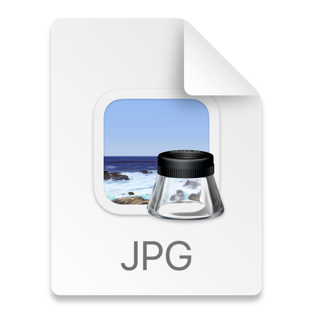

# Task_Management
## 1. [Задание и требования](#1)
## 2. [Функционал API, эндпойнты и технические особенности](#2)
## 3. [Стек технологий](#3)
## 4. [Запуск проекта через docker compose и ссыылка на него](#4)
## 5. [Автор проекта:](#5)

## 1. Описание  <a id=1></a>

**Необходимо разработать систему управления задачами, состоящую из следующих компонентов:**\
    1. **API для управления задачами (Django + Django REST Framework)**\
    2. **Асинхронная обработка задач (Celery + RabbitMQ)**\
    3. **Мониторинг Celery задач (Flower)**\
    4. **Поиск задач (Elasticsearch)**\
    5. **Контейнеризация приложения (Docker)**\
**Требования**\
    1. *API для управления задачами:*\
        ◦ Реализовать создание, чтение, обновление и удаление задач.\
        ◦ Задача должна содержать поля: название, описание, статус (в очереди, в процессе, завершена), и время создания.\
        ◦ Создать отдельный эндпоинт для получения списка всех задач.\
    2. *Асинхронная обработка задач:*\
        ◦ Создание задачи должно ставить её в очередь на обработку через Celery.
        ◦ Использовать RabbitMQ в качестве брокера для Celery.
        ◦ Обработка задачи заключается в простом ожидании (например, time.sleep(10)), после чего задача помечается как завершённая.
    3. *Мониторинг Celery задач:*\
        ◦ Настроить Flower для мониторинга Celery задач.\
        ◦ Обеспечить доступ к Flower через веб-интерфейс.\
    4. *Поиск задач:*\
        ◦ Реализовать возможность поиска задач по названию и описанию через Elasticsearch.\
        ◦ Обеспечить индексацию задач при создании и обновлении.\
    5. *Контейнеризация:*\
        ◦ Написать Dockerfile и docker-compose файл для контейнеризации всех компонентов системы (Django, PostgreSQL, RabbitMQ, Elasticsearch, Flower).\
**Указания**\
    1. Стартовый проект:\
        ◦ Создай новый проект Django.\
        ◦ Настрой PostgreSQL в качестве базы данных.\
        ◦ Добавь необходимые зависимости (Django REST Framework, Celery, Elasticsearch DSL, Flower и т.д.).\
    2. Celery и RabbitMQ:\
        ◦ Настрой Celery для работы с RabbitMQ.\
        ◦ Напиши простой Celery таск для обработки задач (например, ожидание 10 секунд).\
    3. Flower:
        ◦ Настрой Flower для мониторинга Celery задач.\
        ◦ Обеспечь доступ к Flower через веб-интерфейс.\
    4. Elasticsearch:\
        ◦ Настрой подключение к Elasticsearch.\
        ◦ Реализуй индексирование задач и поиск по названию и описанию.\
    5. Docker:\
        ◦ Напиши Dockerfile для Django приложения.\
        ◦ Напиши docker-compose.yml файл для поднятия всех необходимых сервисов (Django, PostgreSQL, RabbitMQ, Elasticsearch, Flower).\

## 2. Функционал API, эндпойнты и технические особенности <a id=2></a>
Создан UserManager и кастомный пользователь CustUser с регистрацией по email. ()
Написана COLLECT_SCHEMA для документирования эндпойнтов.
- https://localhost/api/swagger/ реализована возможность автоматической генерации документации для вашего API, с помощью Swagger
- https://localhost/api/redoc/ реализована возможность автоматической генерации документации для вашего API, с помощью Redoc
- http://localhost/api/users/  Djoser эндпойнты. Работа с пользователями. Регистрация пользователей, удаление, изменение данных.Вывод пользователей. POST, GET, PUT, PATCH, DEL запросы.(Смотри документацию Swagger или Redoc)
- http://localhost/api/auth/token/login/ Djoser эндпойнт.POST-запрос. Вход по email и паролю и получение токена.
- http://localhost/api/auth/token/login/ Djoser эндпойнт.POST-запрос. Выход и удаление токена.
- Реализовано создание, чтение, обновление и удаление задач(Подробно описано COLLECT_SCHEMA ) (Приложение task)
  https://localhost/api/tasks/...
- http://localhost:8000/api/tasks/ GET.Получить список всех задач пользователей (Необходимо авторизоваться!)
- http://localhost:8000/api/tasks/ POST. Создание новой задачи (Необходимо аутентификация!) 
- http://localhost:8000/api/tasks/{id} GET. Получить информацию о задаче по ID. (Доступно только автору или админу)
- http://localhost:8000/api/tasks/{id} PUT. Обновить информацию о задаче.  (Доступно только автору или админу).
- http://localhost:8000/api/tasks/{id} PATCH. Обновить информацию о задаче частично. (Доступно только автору или админу).
- http://localhost:8000/api/tasks/{id} DELETE. Удаляет текущую задачу (Доступно только автору или админу).
- На эндпойнт  http://localhost:8000/api/tasks/ POST повешена задача : process_task.delay(task_id), где в момент ее создания у нее статус "В очереди"
  и спустя 10 секунд он переходит в статус "Завершена" (Использовано RabbitMQ в качестве брокера для Celery и веб-интерфейс интерфейс Flower)\
**Также добавлен Elasticsearch документ для модели Task и он имеет следующие эндпойты:**
- http://localhost:8000/api/task-documents/ GET. Поиск задач по названию(name) и описанию(description) через Elasticsearch"
- Подключена БД PostgreSQL, но можно также использовать sqlite3 в зависимости от параметра DB_ENGINE в файле .env
- Написан файл docker-compose.yml 



## 3. Стек технологий <a id=3></a>
[](https://www.djangoproject.com) 
[](https://www.django-rest-framework.org/) 
[](https://djoser.readthedocs.io/en/latest/getting_started.html) 
[](https://nginx.org/ru/)  
[](https://www.postgresql.org/) 
[](https://docs.celeryq.dev/en/stable/)
[](https://www.rabbitmq.com/)
[](https://flower.readthedocs.io/en/latest/)
[](https://www.elastic.co/elasticsearch)
[](https://swagger.io/)
[](https://gunicorn.org/) 
[](https://www.docker.com/)
[](https://docs.docker.com/compose/)

## 4. Запуск проекта через docker compose и ссыылка на него <a id=4></a>
## Запуск проекта локально в Docker-контейнерах с помощью Docker Compose

Склонируйте проект из репозитория:

```shell
git clone git@github.com:DPavlen/Task_Management.git
```

Перейдите в директорию проекта:

```shell
cd Task_Management/
```
Ознакомьтесь с .env.example и после этого перейдите в  
корень директории **Task_Management/** и создайте файл **.env**:

```shell
nano .env
```

Добавьте строки, содержащиеся в файле **.env.example** и подставьте 
свои значения.

Пример из .env файла:

```dotenv
SECRET_KEY=DJANGO_SECRET_KEY        # Ваш секретный ключ Django
DEBUG=False                         # True - включить Дебаг. Или оставьте пустым для False
IS_LOGGING=False                    # True - включить Логирование. Или оставьте пустым для False
ALLOWED_HOSTS=127.0.0.1 backend     # Список адресов, разделенных пробелами


# Помните, если вы выставляете DEBUG=False, то необходимо будет настроить список ALLOWED_HOSTS.
# 127.0.0.1 и backend является стандартным значением. Через пробел.
# Присутствие backend в ALLOWED_HOSTS обязательно.

В зависимости какую БД нужно запустит:
#DB_ENGINE=sqlite3
DB_ENGINE=postgresql

POSTGRES_USER=django_user                  # Ваше имя пользователя для бд
POSTGRES_PASSWORD=django                   # Ваш пароль для бд
POSTGRES_DB=django                         # Название вашей бд
DB_HOST=db                                 # Стандартное значение - db
DB_PORT=5432                               # Стандартное значение - 5432

```

```shell
В директории **docker** проекта находится файл **docker-compose.yml**, с 
помощью которого вы можете запустить проект локально в Docker контейнерах.
```

Находясь в директории **Task_Management/** выполните следующую команду:

> **Примечание.** Если нужно - добавьте в конец команды флаг **-d** для запуска
> в фоновом режиме. Она сбилдит Docker образы и запустит backend django, СУБД PostgreSQL, Rabbitmq, FLOWER
> Elasticsearch и Nginx в отдельных Docker контейнерах.
```shell
sudo docker compose -f docker-compose.yml up --build
```

>**Примечание.** Запускаем собраный уже ранее командой:
```shell      
sudo docker compose -f docker-compose.yml up -d**
```

>**Примечание.** Для MAC OS  flower The requested image's platform (linux/amd64) does not match the detected host platform (linux/arm64/v8) and no specific platform was requested  нужно использовать:     
```shell      
docker restart task_management-flower-1
```

>**Примечание.** Для того чтобы необходимо остановить и удалить контейнер нужно использовать:   
```shell
sudo docker compose -f docker-compose.yml down 
```

По завершении всех операции проект будет запущен и доступен по адресу
http://127.0.0.1/ или http://localhost/ в зависимости от настроек

Либо просто завершите работу Docker Compose в терминале, в котором вы его
запускали, сочетанием клавиш **CTRL+C**.

***
 
## 5. Автор проекта: <a id=5></a> 

**Павленко Дмитрий**  
- Ссылка на мой профиль в GitHub [Dmitry Pavlenko](https://github.com/DPavlen)  


